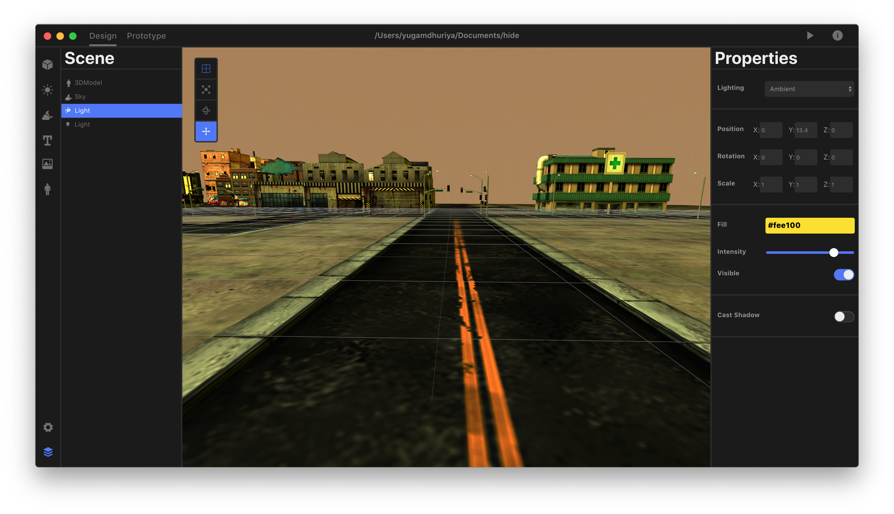
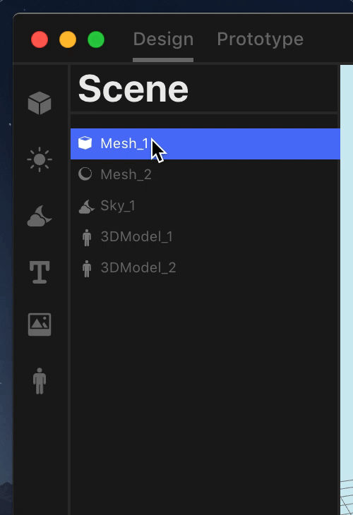

# Introduction
Lmonix is a desktop application for creating webVR prototype's, the tool consist's of a simple design editor for creating the static scene and a prototype editor for creating animation's and adding logic using script's. The following scene can been exported out as aframe component's, with all the necessary script's and asset's. The main goal of this project was to create a simple prototyping tool for designers and developers.

# Design
The design editor is used for building the static scene, you can add entities such as basic 3D objects, lighting, environments, images / videos, 3D models etc. After adding the entities they will be displayed under the scene. On the right hand side the properties of each individual entity will appear when you select them. 

## Scene 

The scene represent the entities you added inside your render, over here you can interact with each individual object or a group of objects. Over here you can copy/paste, delete, rename them, group with other entites etc. `note: These options appear when you right click on the active entity inside the scene`. The naming for each individual object needs to be unique because the name for each object can be used during prototyping individually.

Drag/Drop | Copy/Paste | Group In
--- | --- | ---
 | | 3

## Entity Properties
You can edit each individual entity properties, which are displayed on the right hand side of the application window. Over here we can edit common properties such as rotation, scale, position, change material based attributes, add assets, add shadow's etc. 

## Adding Assets
Currently the type of assets which are being supported are images(jpg, mpg, jpeg, wepb), video(mp4, webm), sound(mp3), 3D models(gtlf & obj) only. Assets are available on mesh based entities as `Texture` or `3D Model`. To add a new asset you would get the option on the properties section as `Add Texture` or `Add Models`. Google Poly Models can be accessed by clicking on the poly logo, which provides you whole bunch of low poly models.

# Prototype
The prototype editor is used for adding animations and interactions to our static scene, over here each individual element can be added multiple animation properties at the very same time. We can build also build a timeline across the animations we have added, inside prototype we also have a code editor where we can add our logic and interactions for each individual entity.

# Available Scripts

In the project directory, you can run:

### `yarn start`

Runs the app in the development mode. 
Open [http://localhost:3000](http://localhost:3000) to view it in the browser.

The page will reload if you make edits. 
You will also see any lint errors in the console.

### `npm test`

Launches the test runner in the interactive watch mode. 
See the section about [running tests](https://facebook.github.io/create-react-app/docs/running-tests) for more information.

### `yarn run build`

Builds the app for production to the `build` folder. 
It correctly bundles React in production mode and optimizes the build for the best performance.

The build is minified and the filenames include the hashes. 
Your app is ready to be deployed!

See the section about [deployment](https://facebook.github.io/create-react-app/docs/deployment) for more information.
